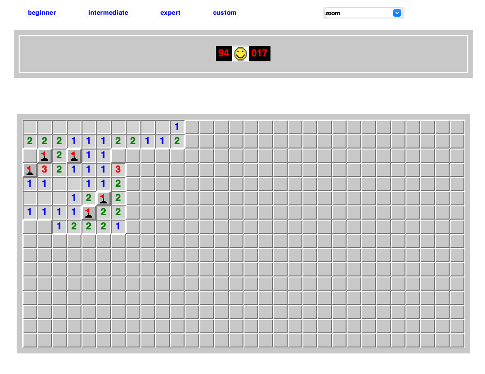

# minesweeper.py

This is one of the first programming projects I ever worked on back in 2021. I just wanted to see if I could recreate one of my favorite games, MineSweeper using python. The end result was suprisingly good and fun. I was able to recreate almost 1 to 1 the minesweeper I know and love.

The UI looks something like this:

Not bad for a novice programmer at the time. The game is pretty quick and includes all the expected features.

Original I had planned to build an AI that could solve the game but I never ended up implementing that. That may be a future task.
